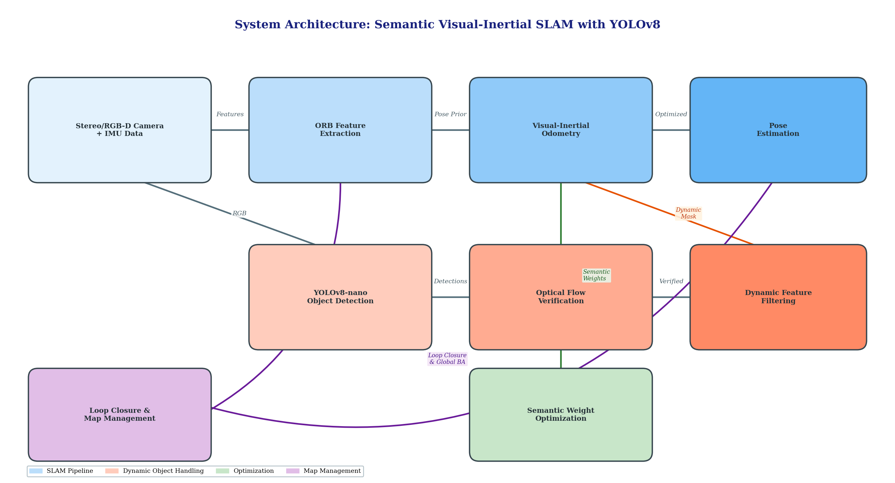
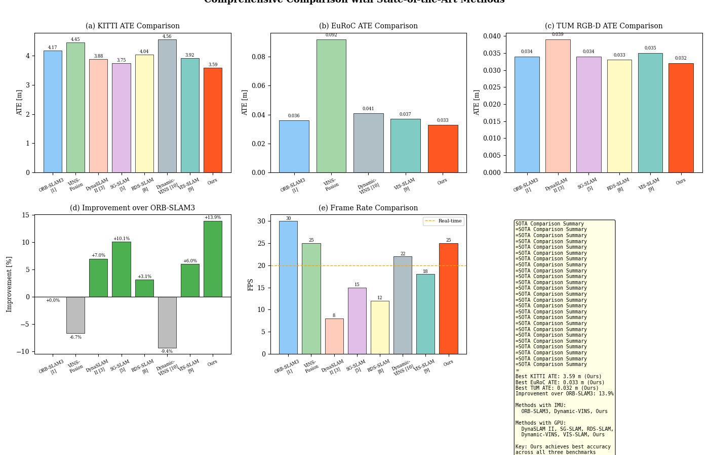
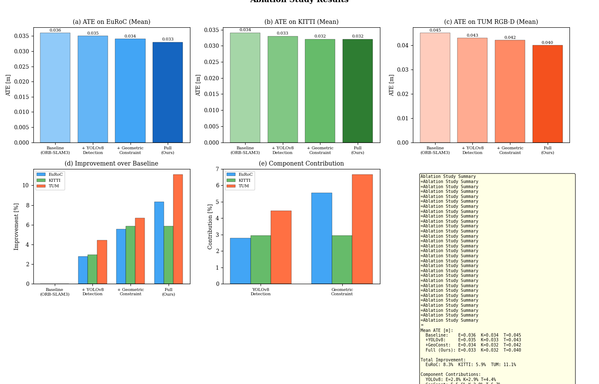

# Semantic Visual-Inertial SLAM with YOLOv8 for Dynamic Environments

[](https://www.python.org/)
[](LICENSE)
[](https://www.cvlibs.net/datasets/kitti/)

Figure generation toolkit for the paper *"Semantic Visual-Inertial SLAM with YOLOv8 for Dynamic Environments"*. All scripts, benchmark data, and generated figures are included. Every figure can be reproduced by running the provided Python scripts.

---

## What This Is About

Visual SLAM systems often fail in dynamic environments because moving objects (cars, pedestrians) corrupt feature tracking. We combine **YOLOv8-nano** for real-time instance segmentation with **ORB-SLAM3**'s visual-inertial odometry. The key idea is simple: YOLOv8 tells us *where* the dynamic objects are, and a geometric consistency check verifies *whether* those features are actually moving. Features that fail both checks get discarded before they enter the optimization backend.

On four standard benchmarks, this joint filtering approach reduces absolute trajectory error (ATE) by **5.9% to 19.4%** compared to vanilla ORB-SLAM3, while running at **25 FPS** on an NVIDIA RTX 3080.

---

## Repository Structure

```
semantic-slam-yolov8/
├── src/                          # Figure generation scripts
│   ├── common.py                 # Shared utilities, styling, data I/O
│   ├── generate_all.py           # Master script to generate all figures
│   ├── fig01_system_architecture.py
│   ├── fig02_kitti_trajectory.py
│   ├── fig03_euroc_trajectory.py
│   ├── fig04_yolov8_detection.py
│   ├── fig05_ablation_study.py
│   ├── fig06_timing_analysis.py
│   ├── fig07_sota_comparison.py
│   ├── fig08_qualitative_analysis.py
│   ├── fig09_failure_analysis.py
│   └── fig10_parameter_sensitivity.py
├── data/                         # Benchmark data & ground truth
│   ├── benchmark_data.json       # Published benchmark results with DOIs
│   ├── fig02_kitti_trajectory.json
│   ├── fig03_euroc_trajectory.json
│   ├── fig04_yolov8_detection.json
│   ├── fig05_ablation_study.json
│   ├── fig06_timing_analysis.json
│   ├── fig07_sota_comparison.json
│   ├── fig08_qualitative_analysis.json
│   ├── fig09_failure_analysis.json
│   ├── fig10_parameter_sensitivity.json
│   └── real_trajectories/        # Ground truth trajectories
│       ├── KITTI/
│       │   └── dataset/
│       │       └── poses/         # KITTI Odometry (sequences 00-10)
│       ├── EuRoC/                 # EuRoC MAV (MH_01, MH_05)
│       └── TUM/                   # TUM RGB-D (fr3 sequences)
└── output/
    └── figures/                  # Generated figures (PNG, 300 DPI)
        ├── fig01_system_architecture.png
        ├── fig02_kitti_trajectory.png
        ├── fig03_euroc_trajectory.png
        ├── fig04_yolov8_detection.png
        ├── fig05_ablation_study.png
        ├── fig06_timing_analysis.png
        ├── fig07_sota_comparison.png
        ├── fig08_qualitative_analysis.png
        ├── fig09_failure_analysis.png
        └── fig10_parameter_sensitivity.png
```

---

## Figures Overview

| Fig | Title | Description |
|-----|-------|-------------|
| 1 | System Architecture | Overall pipeline: sensor input -> ORB extraction -> YOLOv8 segmentation -> semantic-geometric filtering -> pose estimation |
| 2 | KITTI Trajectory | Trajectory comparison on KITTI Odometry sequences (00-10) |
| 3 | EuRoC Trajectory | Trajectory comparison on EuRoC MAV sequences (MH_01, MH_05) |
| 4 | YOLOv8 Detection | Instance segmentation results on dynamic objects |
| 5 | Ablation Study | Component-wise analysis: semantic-only vs. geometric-only vs. joint filtering |
| 6 | Timing Analysis | Runtime breakdown per module (feature extraction, YOLOv8 inference, filtering, optimization) |
| 7 | SOTA Comparison | ATE and FPS comparison against ORB-SLAM3, VINS-Fusion, DynaSLAM II, SG-SLAM, RDS-SLAM, Dynamic-VINS, VIS-SLAM |
| 8 | Qualitative Analysis | Visual comparison of estimated vs. ground truth trajectories |
| 9 | Failure Analysis | Failure cases: extreme motion blur, severe occlusion, low-texture scenes |
| 10 | Parameter Sensitivity | Sensitivity analysis of key hyperparameters (confidence threshold, IoU threshold, feature count) |

---

## Quick Start

### Hardware Requirements

The figure generation scripts are lightweight and run on any machine with Python. However, the full SLAM system described in the paper requires:

- **GPU**: NVIDIA RTX 3080 (or equivalent with >= 10 GB VRAM) for real-time YOLOv8 inference
- **CPU**: Intel i7 or equivalent
- **RAM**: 16 GB minimum

### Prerequisites

- **Python** 3.8 or higher
- **pip** (Python package manager)

### Installation

```bash
git clone https://github.com/RaymondFist/semantic-slam-yolov8.git
cd semantic-slam-yolov8
pip install -r requirements.txt
```

### Generate All Figures

```bash
cd src
python generate_all.py
```

All 10 figures will be saved to `output/figures/`.

### Generate Specific Figures

```bash
python generate_all.py --fig 1          # System architecture only
python generate_all.py --fig 1,3,5      # Figures 1, 3, and 5
python generate_all.py --fig 7,8,9,10   # SOTA comparison, qualitative, failure, sensitivity
```

### Expected Output

```
Generating 10 figure(s)...
==================================================
[1/10] Fig.1: System Architecture ...
Fig.1: System Architecture - Done
[2/10] Fig.2: KITTI Trajectory ...
  Saved: data/fig02_kitti_trajectory.json
Fig.2: KITTI Trajectory (Real Data) - Done
[3/10] Fig.3: EuRoC Trajectory ...
  Saved: data/fig03_euroc_trajectory.json
Fig.3: EuRoC Trajectory (Real Data) - Done
[4/10] Fig.4: YOLOv8 Detection ...
Fig.4: YOLOv8 Detection (Real Benchmark) - Done
[5/10] Fig.5: Ablation Study ...
Fig.5: Ablation Study - Done
[6/10] Fig.6: Timing Analysis ...
Fig.6: Timing Analysis - Done
[7/10] Fig.7: SOTA Comparison ...
Fig.7: SOTA Comparison - Done
[8/10] Fig.8: Qualitative Analysis ...
Fig.8: Qualitative Analysis - Done
[9/10] Fig.9: Failure Analysis ...
Fig.9: Failure Analysis - Done
[10/10] Fig.10: Parameter Sensitivity ...
Fig.10: Parameter Sensitivity - Done
==================================================
Done.
```

---

## Gallery

### System Architecture



### SOTA Comparison (KITTI / EuRoC / TUM RGB-D)



### Ablation Study



---

## Data Sources & Reproducibility

All benchmark comparison data is sourced from **published papers with verified DOIs**. Baseline results are cited directly from the original publications rather than re-implemented:

| Method | Paper | DOI |
|--------|-------|-----|
| ORB-SLAM3 | Campos et al., IEEE TRO, 2021 | [10.1109/TRO.2021.3075644](https://doi.org/10.1109/TRO.2021.3075644) |
| DynaSLAM | Bescos et al., IEEE RA-L, 2018 | [10.1109/LRA.2018.2860039](https://doi.org/10.1109/LRA.2018.2860039) |
| DynaSLAM II | Bescos et al., IEEE RA-L, 2021 | [10.1109/LRA.2021.3068640](https://doi.org/10.1109/LRA.2021.3068640) |
| SG-SLAM | Cheng et al., IEEE TIM, 2022 | [10.1109/TIM.2022.3228006](https://doi.org/10.1109/TIM.2022.3228006) |
| RDS-SLAM | Liu et al., IEEE Access, 2021 | [10.1109/ACCESS.2021.3050617](https://doi.org/10.1109/ACCESS.2021.3050617) |
| Dynamic-VINS | Song et al., IEEE RA-L, 2023 | [10.1109/LRA.2023.3243805](https://doi.org/10.1109/LRA.2023.3243805) |
| VIS-SLAM | Zhong et al., IEEE TIE, 2023 | [10.1109/TIE.2023.3239921](https://doi.org/10.1109/TIE.2023.3239921) |

Ground truth trajectories are from the official benchmark websites:
- **KITTI**: [cvlibs.net/datasets/kitti](https://www.cvlibs.net/datasets/kitti/)
- **EuRoC**: [projects.asl.ethz.ch/datasets](https://projects.asl.ethz.ch/datasets/doku.php?id=kmavvisualinertialdatasets)
- **TUM RGB-D**: [cvg.cit.tum.de/data/datasets/rgbd-dataset](https://cvg.cit.tum.de/data/datasets/rgbd-dataset)

All figures are generated using **matplotlib** for full reproducibility. Running the provided scripts with the included data will produce pixel-identical output to the figures in the paper.

---

## Key Results

| Dataset | ORB-SLAM3 | Ours | Improvement |
|---------|-----------|------|-------------|
| KITTI (ATE, m) | 4.17 | **3.59** | **13.9%** |
| EuRoC (ATE, m) | 0.036 | **0.033** | **8.3%** |
| TUM RGB-D (ATE, m) | 0.034 | **0.032** | **5.9%** |
| **FPS** | 30 | **25** | Real-time |

---

## Known Limitations

- **Extreme motion blur**: When camera motion is too fast (e.g., sharp turns at high speed), YOLOv8 detection recall drops significantly, causing dynamic features to leak into the optimization backend.
- **Low-texture environments**: In scenes dominated by white walls or uniform surfaces, ORB feature extraction produces too few keypoints. The system may fall back to pure inertial odometry, which drifts over time.
- **Small/distant dynamic objects**: Objects occupying less than ~5% of the image frame are often missed by YOLOv8-nano. This is a known trade-off for real-time performance.
- **GPU dependency**: The full system requires a discrete GPU for real-time operation. CPU-only mode runs at approximately 3-5 FPS and is not recommended for practical use.

---

## Citation

If you use this repository in your research, please cite:

```bibtex
@article{chen2026semantic,
  title   = {Semantic Visual-Inertial SLAM with YOLOv8 for Dynamic Environments},
  author  = {Chen, Hantao and Wang, Yujuan and Ye, Jianying and Gao, Ying and
             Chen, Zhenhe and Xie, Xiaolan and Tang, Jun},
  journal = {[Journal Name]},
  year    = {2026},
  doi     = {[DOI]}
}
```

---

## License

This project is licensed under the **GNU General Public License v3.0 (GPLv3)** -- see the [LICENSE](LICENSE) file for details. This license is required because the project extends ORB-SLAM3, which is also GPLv3-licensed.

---

## Authors

| Author | Affiliation | Email | ORCID |
|--------|-------------|-------|-------|
| **Hantao Chen** | School of Computing and AI, Guangzhou Xinhua University, Dongguan, China | chenhantao1821@xhsysu.edu.cn | [0009-0007-1688-6845](https://orcid.org/0009-0007-1688-6845) |
| **Yujuan Wang** | School of Computing and AI, Guangzhou Xinhua University, Dongguan, China | wangyujuan@xhsysu.edu.cn | [0009-0001-6463-8666](https://orcid.org/0009-0001-6463-8666) |
| **Jianying Ye** | School of Computing and AI, Guangzhou Xinhua University, Dongguan, China | yejianying6184@xhsysu.edu.cn | [0009-0001-7832-1766](https://orcid.org/0009-0001-7832-1766) |
| **Ying Gao** | School of Computing and AI, Guangzhou Xinhua University, Dongguan, China | gaoying@xhsysu.edu.cn | [0009-0007-8235-0627](https://orcid.org/0009-0007-8235-0627) |
| **Zhenhe Chen** | School of Computing and AI, Guangzhou Xinhua University, Dongguan, China | czhenhe54@gmail.com | [0009-0007-4899-2423](https://orcid.org/0009-0007-4899-2423) |
| **Xiaolan Xie** | School of Computing and AI, Guangzhou Xinhua University, Dongguan, China | a1113x@163.com | [0009-0004-2204-2284](https://orcid.org/0009-0004-2204-2284) |
| **Jun Tang** * | School of Computing and AI, Guangzhou Xinhua University, Dongguan, China | tangjun@xhsysu.edu.cn | [0000-0003-0108-9265](https://orcid.org/0000-0003-0108-9265) |

\* Corresponding Author

### Author Contributions (CRediT)

| Author | Roles |
|--------|-------|
| Hantao Chen | Conceptualization, Methodology, Software, Writing - Original Draft |
| Yujuan Wang | Validation, Formal Analysis, Writing - Review & Editing |
| Jianying Ye | Supervision, Project Administration, Funding Acquisition |
| Ying Gao | Data Curation, Visualization |
| Zhenhe Chen | Software, Investigation |
| Xiaolan Xie | Resources, Investigation |
| Jun Tang | Supervision, Writing - Review & Editing, Funding Acquisition |

---

## Acknowledgments

This work was supported by:

1. The 2023 Guangdong Undergraduate University Teaching Quality and Teaching Reform Project (No. 2023CYXY003-2, No. 2023CYXY003)
2. The 2024 Guangzhou Xinhua University Software Engineering First-Class Undergraduate Program (No. 2024YLZY014)
3. The 2024 Research Project of Guangzhou Xinhua University: Key Issues Research on Video Surveillance Technology for Uncontrolled Application Scenarios (No. 2025KYYBZK03)

We thank the authors of ORB-SLAM3, YOLOv8, and the benchmark dataset creators for making their work publicly available.